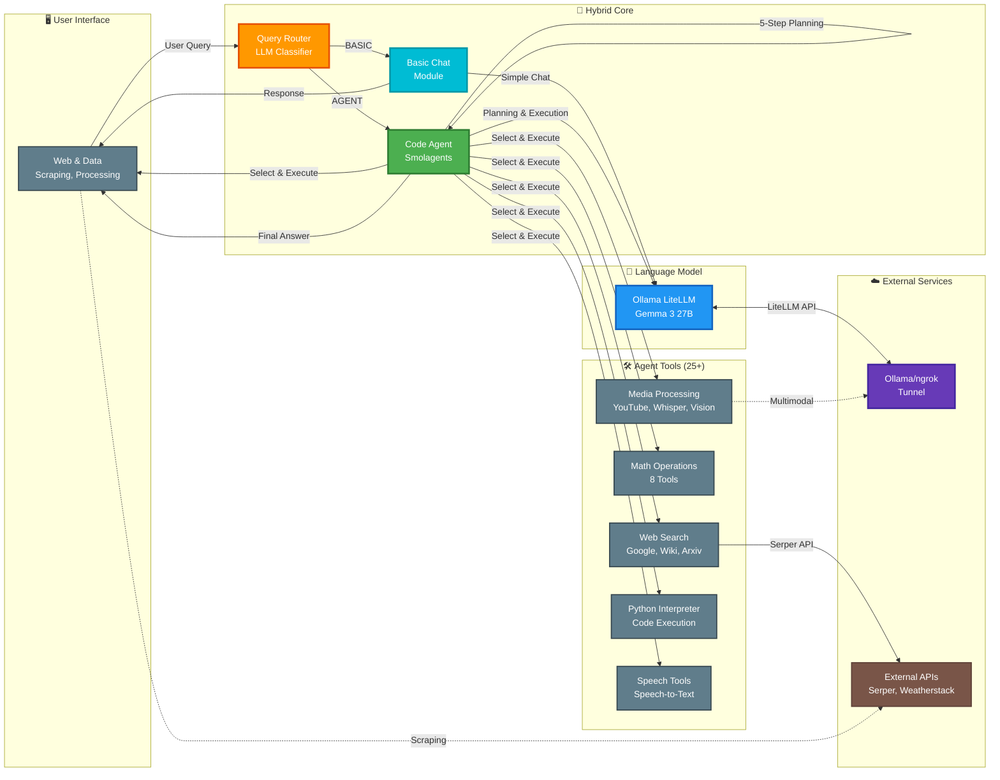
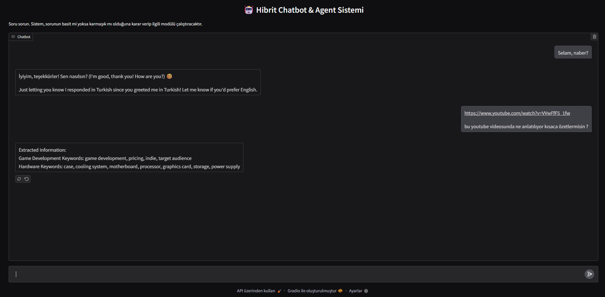

# 🤖 Hybrid Chatbot and Agent System with Smolagents

An advanced AI agent system built with HuggingFace's **Smolagents** framework, featuring intelligent query routing, 25+ specialized tools, and a sophisticated CodeAgent capable of dynamic task planning and execution. Built with Gradio for an intuitive user interface.

## 📊 Architecture



## 📸 Live Demo



*Screenshot showing the agent handling complex multi-step queries with tool orchestration and planning*

## ✨ Key Features

### 🎯 Intelligent Query Routing
- **Smart Classification**: LLM-powered router analyzes queries and routes to appropriate module
- **Dual Processing**: Fast basic responses for simple queries, comprehensive agent execution for complex tasks
- **Optimized Performance**: Minimizes unnecessary agent calls

### 🧠 Smolagents CodeAgent
- **Dynamic Planning**: 5-step planning interval for complex task decomposition
- **Code Generation**: Generates and executes Python code on-the-fly
- **Tool Orchestration**: Intelligently selects and chains 25+ specialized tools
- **Error Recovery**: Built-in error handling and retry mechanisms

### 🛠️ Comprehensive Tool Suite (25+ Tools)

| Category | Tools | Count | Description |
|----------|-------|-------|-------------|
| **Web Search** | Google (Serper), Wikipedia, Arxiv, DuckDuckGo | 4 | Real-time web and academic search |
| **Mathematics** | Add, Subtract, Multiply, Divide, Power, Square Root, Log, Modulus | 8 | Complete mathematical operations |
| **Media Processing** | YouTube Downloader, YouTube Transcriber, Audio Transcriber, Image Captioner | 4 | Video/audio/image analysis |
| **Data & Web** | Web Scraping, Data Processing, File Download | 3 | Advanced data extraction and processing |
| **Code Execution** | Python Interpreter | 1 | Dynamic Python code execution |
| **Communication** | Speech-to-Text, Visit Webpage, Final Answer | 3 | Communication utilities |
| **Weather** | Weather API | 1 | Real-time weather information |

### 🔧 Advanced Capabilities

- **Web Scraping Tool**: Extract tables, links, text, images, specific elements with CSS selectors
- **Data Processing Tool**: Parse tables, extract numbers, calculate expressions, format text, find patterns
- **Multimodal Vision**: Analyze images with text prompts using Ollama's multimodal capabilities
- **YouTube Integration**: Download and transcribe videos automatically
- **Dynamic Code**: Execute arbitrary Python with authorized imports

## 🛠️ Technologies Used

### Core Framework
- **Smolagents 1.16**: HuggingFace's agentic AI framework with CodeAgent
- **LiteLLM**: Universal LLM interface supporting Ollama and cloud providers
- **Gradio 5.29**: Modern, interactive web UI
- **Ollama**: Local LLM inference (Gemma 3 27B)

### AI & ML
- **Whisper (OpenAI)**: Speech-to-text transcription
- **Faster-Whisper**: Optimized Whisper implementation
- **Transformers 4.51**: Hugging Face model library
- **OpenCV**: Computer vision operations
- **LangChain**: Document loaders (Wikipedia, Arxiv)

### Python Libraries
- **requests**: HTTP client
- **BeautifulSoup4**: Web scraping
- **pandas**: Data manipulation
- **Pillow**: Image processing
- **yt-dlp**: YouTube downloads
- **python-dotenv**: Environment management

### External Services
- **Serper API**: Google Search integration
- **Weatherstack API**: Weather data
- **ngrok**: Secure tunneling to Ollama
- **Hugging Face**: File hosting and resources

## 📥 Installation

### Prerequisites

1. **Ollama Server**: Install and run Ollama
   ```bash
   ollama pull gemma3:27b
   ollama serve
   ```

2. **ngrok** (Optional): For remote Ollama access
   ```bash
   ngrok http 11434
   ```

3. **Python 3.9+**: Ensure Python is installed

4. **FFmpeg**: Required for audio/video processing
   - Windows: Download from [ffmpeg.org](https://ffmpeg.org/)
   - Linux: `sudo apt install ffmpeg`
   - macOS: `brew install ffmpeg`

### Install Dependencies

```bash
git clone https://github.com/baloglu321/Hibrit_Chatbot_Agent.git
cd Hibrit_Chatbot_Agent
pip install -r requirements.txt
```

## ⚙️ Configuration

### CRITICAL: Environment Variables Setup

Create a `.env` file in the project root with your API keys:

```env
# Ollama Server Configuration
OLLAMA_SERVER=https://your-ngrok-url.ngrok-free.app
MODEL_ID=gemma3:27b

# API Keys (REQUIRED)
SERPER_API_KEY=your-serper-api-key-here
WEATHER_API=your-weatherstack-api-key-here
```

### Update Configuration Files

**For `agent.py`** - Add at the top of the file:

```python
from dotenv import load_dotenv
import os

load_dotenv()

ollama_server = os.getenv("OLLAMA_SERVER", "http://localhost:11434")
model_id = os.getenv("MODEL_ID", "gemma3:27b")
WEATHER_API = os.getenv("WEATHER_API")
```

**For `app.py`** - Update the ngrok URL:

```python
from dotenv import load_dotenv
import os

load_dotenv()

OLLAMA_SERVER = os.getenv("OLLAMA_SERVER", "http://localhost:11434")
```

### Get API Keys

| Service | Purpose | Get Key | Free Tier |
|---------|---------|---------|-----------|
| **Serper** | Google Search | [serper.dev](https://serper.dev) | 2,500 queries/month |
| **Weatherstack** | Weather Data | [weatherstack.com](https://weatherstack.com) | 1,000 requests/month |

## 🚀 Usage

Start the application:

```bash
python app.py
```

Access at `http://127.0.0.1:7860`

### Example Queries

**Basic Mode (Fast Response):**
- "Hello, how are you?"
- "Tell me about Python"
- "What's your name?"

**Agent Mode (Tool-Powered):**
- "What's the weather in Tokyo?" → Weather API
- "Search for the latest AI breakthroughs" → Google Search
- "Calculate 15^3 + sqrt(625)" → Math Tools
- "Download and transcribe this YouTube video: [URL]" → YouTube + Whisper
- "What's in this image: photo.jpg?" → Image Captioner
- "Extract all tables from https://example.com" → Web Scraping
- "Find academic papers about transformers" → Arxiv Search

## 🏗️ Project Structure

```
Hibrit_Chatbot_Agent/
├── agent.py              # CodeAgent setup and 25+ custom tool definitions
├── app.py                # Gradio UI with hybrid routing logic
├── app_agent.py          # Alternative agent interface
├── deneme.py             # Testing/demo script
├── requirements.txt      # Python dependencies
├── system_ prompt.txt     # Agent system instructions
├── screenshots/          # Demo screenshots
│   └── agent.png
└── README.md             # This file
```

## 🧰 Complete Tool List

### 1. Web Search & Research (4 tools)
- **GoogleSearchTool (Serper)**: Real-time Google search with Serper API
- **WikipediaSearchTool**: Encyclopedic knowledge, up to 2 documents
- **ArxivSearchTool**: Academic papers and research, up to 3 documents
- **DuckDuckGoSearchTool**: Privacy-focused web search

### 2. Mathematics (8 tools)
- **MultiplyTool**: Multiplication operations
- **AddTool**: Addition operations
- **SubtractTool**: Subtraction operations
- **DivideTool**: Division with zero-check
- **PowerTool**: Exponentiation (a^b)
- **SquareRootTool**: Square root calculation
- **LogarithmTool**: Natural logarithm
- **ModulusTool**: Modulus operation

### 3. Media Processing (4 tools)
- **YouTubeDownloadTool**: Download YouTube videos (yt-dlp)
- **YouTubeTranscriptTool**: Download audio + transcribe with Whisper
- **TranscriberTool**: Transcribe local audio files
- **ImageCaptionerTool**: Multimodal image analysis with text prompts

### 4. Data & Web Tools (3 tools)
- **WebScrapingTool**: Extract tables, links, text, images, elements (BeautifulSoup)
- **DataProcessingTool**: Extract numbers, parse tables, calculate, format, find patterns
- **FileDownloadTool**: Download and parse Excel/JSON files from URLs

### 5. Code Execution (1 tool)
- **PythonInterpreterTool**: Execute Python code with authorized imports

### 6. Communication Tools (3 tools)
- **SpeechToTextTool**: Convert speech to text
- **VisitWebpageTool**: Fetch and analyze web pages
- **FinalAnswerTool**: Format final responses

### 7. Weather (1 tool)
- **WeatherInfoTool**: Real-time weather via Weatherstack

## 🔍 How It Works

### 1. Query Routing
```
User Query → route_question() → LLM Classification → "BASIC" or "AGENT"
```

### 2. Basic Path
```
BASIC → call_llm() → Direct Ollama Response → User
```

### 3. Agent Path (Smolagents CodeAgent)
```
AGENT → CodeAgent.run() → Multi-Step Planning (interval=5) →
Tool Selection → Code Generation → Tool Execution →
[Iterate if needed] → Final Answer → User
```

### 4. CodeAgent Workflow
```
1. Understand query and available tools
2. Generate plan (every 5 steps)
3. Write Python code using tools
4. Execute code in sandbox
5. Observe results and adapt
6. Return final answer
```

## 🛑 Troubleshooting

| Issue | Cause | Solution |
|-------|-------|----------|
| `ConnectionError` to Ollama | Server not running or wrong URL | Check `ollama serve` and ngrok URL |
| `SERPER_API_KEY not found` | Missing environment variable | Create `.env` file with API keys |
| `ModuleNotFoundError: smolagents` | Missing dependencies | Run `pip install -r requirements.txt` |
| YouTube download fails | yt-dlp not installed | `pip install yt-dlp` |
| Whisper fails | FFmpeg missing | Install FFmpeg (see Prerequisites) |
| Image captioning fails | ngrok URL incorrect | Verify multimodal Ollama endpoint |
| Agent stops unexpectedly | Planning interval too low | Increase `planning_interval` in `build_agent()` |

## 🔒 Security Alert & Best Practices

### ⚠️ CRITICAL: Security Fix Applied

**Previous Issue**: Hardcoded Serper API key was found in `agent.py` line 670  
**Status**: ✅ **FIXED** - Now using environment variables

### Security Checklist:
- ✅ Remove all hardcoded API keys
- ✅ Use `.env` file for sensitive data
- ✅ Add `.env` to `.gitignore`
- ✅ Share `.env.example` instead of `.env`
- ✅ Rotate API keys after exposure

### Example `.gitignore`

```gitignore
# Environment
.env
.env.local

# Python
__pycache__/
*.pyc
*.pyo

# Media downloads
*.mp3
*.mp4
audio.mp3
video.mp4

# Downloaded files
downloaded_*
*.xlsx
*.json
```

## 🎯 Use Cases

- **Research Assistant**: Combine Google Search + Wikipedia + Arxiv for comprehensive research
- **Code Assistant**: Generate and execute Python code for complex calculations
- **Data Analyst**: Scrape websites, extract tables, process data automatically
- **Content Analyzer**: Transcribe videos, analyze images, extract insights
- **Weather Reporter**: Real-time weather for any location
- **Math Solver**: Handle complex mathematical expressions with dedicated tools
- **Web Automator**: Visit pages, extract specific elements, process information

## 🆚 Comparison with Other Implementations

| Feature | Smolagents (This) | LangChain | LlamaIndex |
|---------|------------------|-----------|------------|
| **Framework** | HuggingFace Smolagents | LangChain Classic | LlamaIndex |
| **Agent Type** | CodeAgent (Planning) | ReAct (Action-Obs) | ReAct (Tool) |
| **Tool Count** | 25+ tools | 9 tools | 15+ tools |
| **Planning** | 5-step interval | No planning | No planning |
| **Code Generation** | ✅ Dynamic Python | ❌ No | ❌ No |
| **Memory** | Stateless (per query) | BufferWindow (k=10) | Buffer (40k tokens) |
| **Math Tools** | 8 separate | 1 Python REPL | 4 separate |
| **Web Scraping** | ✅ Advanced | ❌ No | ❌ No |
| **Data Processing** | ✅ Built-in | ❌ No | ❌ No |

## 🤝 Contributing

Contributions welcome! Areas for improvement:
- Add vector database integration
- Implement conversation memory
- Add more specialized tools (email, calendar, database)
- Create comprehensive tests
- Optimize planning interval
- Add streaming responses

## 📄 License

This project is open-source and available under the MIT License.

## 🙏 Acknowledgments

- **HuggingFace**: For the powerful Smolagents framework
- **Gradio**: For the intuitive UI library
- **Ollama**: For local LLM inference
- **OpenAI Whisper**: For speech recognition
- **Serper**: For Google Search API access

---

**Built with ❤️ using Smolagents, Gradio, and Ollama**

## 🔗 Related Projects

- [Hibrit_Chatbot_with_llamaindex](https://github.com/baloglu321/Hibrit_Chatbot_with_llamaindex) - LlamaIndex implementation
- [Hibrit_Chatbot_with_langchain](https://github.com/baloglu321/Hibrit_Chatbot_with_langchain) - LangChain implementation
